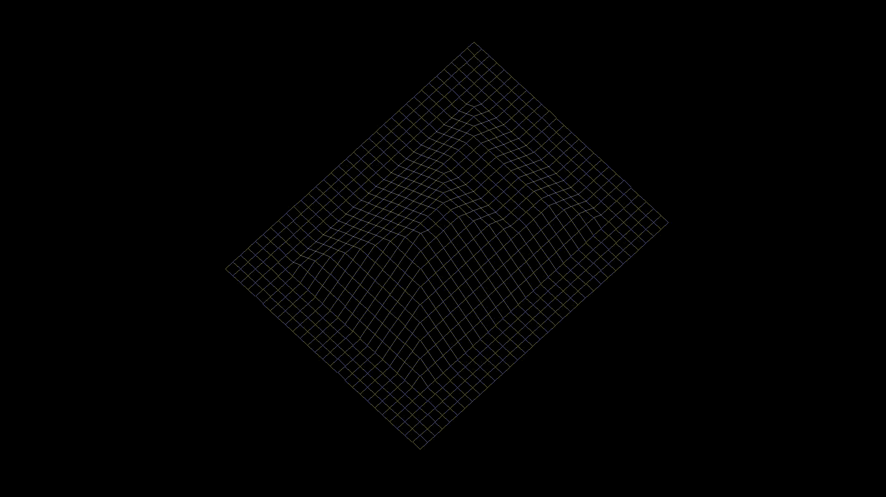

# fdf

## wireframe model representation

This project is a simple wireframe model viewer called "fdf". It reads 3D coordinates from a file and displays them in a 2D window using isometric projection.

[](demo/fdf_demo_y_rot.gif)

### Features

- Reads 3D coordinates from a file
- Displays a wireframe model in a 2D window
- Uses isometric projection for rendering
- Basic user interaction (e.g., zooming, panning, rotating)
- extrude feature to add depth to the model

### Requirements

- C compiler (e.g., gcc)
- MiniLibX library for graphics rendering (included in the repo)
- Make utility for building the project

### Installation
1. Clone the repository:
   ```bash
   git clone https://github.com/ki-ba/fdf.git --recurse-submodules
   ```

2. Navigate to the project directory and build the project:
   ```bash
    cd fdf
    make
    ```

### Usage

Run the program with a file containing 3D coordinates as an argument:
```bash
./fdf path/to/your/file.fdf
```

sample files are available in the `test_maps` directory.

### Controls

- Zoom in/out: `+` / `-`
- Pan: Arrow keys
- Rotate : W/A/S/D
- Extrude : NumPad 8 / NumPad 2
- Reset view: `R`
- Exit: `ESC`

### License

[MIT License](https://mit-license.org/).
